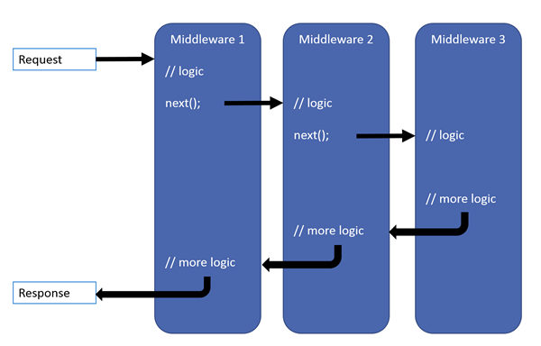

# Middleware in .NET Core

Middleware is a software that's assembled into an app pipeline to handle requests and responses. Each component:

- Chooses whether to pass the request to the next component in the pipeline.
- Can perform work before and after the next component in the pipeline.

Request delegates are used to build the request pipeline. The request delegate handle each HTTP request.

Request delegates are configured using [Run](https://learn.microsoft.com/en-us/dotnet/api/microsoft.aspnetcore.builder.runextensions.run?view=aspnetcore-9.0), [Map](https://learn.microsoft.com/en-us/dotnet/api/microsoft.aspnetcore.builder.mapextensions.map?view=aspnetcore-9.0), and [Use](https://learn.microsoft.com/en-us/dotnet/api/microsoft.aspnetcore.builder.useextensions.use?view=aspnetcore-9.0) extension methods. An individual request delegate can be specified in-line as an anonymous method (called in-line middleware), or it can be defined in a reusable class. The reusable classes and in-line methods are *middleware*, also called *middleware components*. Each middleware component in the request pipeline is responsible for invoking the next component or short-circuiting the pipeline. When a middleware short-circuits, its called a terminal middleware because it prevents further middleware from processing the request.

## Create a middleware pipeline with `WebApplication`

The ASP.NET Core pipeline consists of a sequence of request delegates, called one after the other.



Exception-handling delegates should be called early in the pipeline, so they can catch exceptions that occur in later stages of the pipeline.

The following simplest possible single request delegate that handles all requests.

```csharp
var builder = WebApplication.CreateBuilder(args);
var app = builder.Build();

app.Run(async context =>
{
    await context.Response.WriteAsync("Hello World!");
});

app.Run();
```

Run delegate don't receive a `next` parameter. The first `Run` delegate is always terminal and terminates the pipeline.

Chain multiple request delegates with Use method. The `next` parameter represents the next delegate in the pipeline. Pipeline can be short-circuit by not calling the `next` parameter.

```csharp
var builder = WebApplication.CreateBuilder(args);
var app = builder.Build();

app.Use(async (context, next) =>
{
    // Do work that can write to the Response
    await next.Invoke();
    // Do logging or other work that doesn't write to the Response.
});

app.Run(async context =>
{
    await context.Response.WriteAsync("Hello from 2nd delegate.");
});

app.Run();
```

## Short-circuiting the request pipeline

When a delegate doesn't pass a request to the next delegate, its called short-circuiting the request pipeline. Short-circuiting is often desirable because it avoids unnecessary work. For example, [Static File Middleware](https://learn.microsoft.com/en-us/aspnet/core/fundamentals/static-files?view=aspnetcore-9.0) can act as a *terminal middleware* by processing a request for a static file and short-circuiting the rest of the pipeline.

## Branch the middleware pipeline

Map extensions are used as a convention for branching the pipeline. `Map` branches the request pipeline based on matches of the given request path. If the request path starts with the given path, the branch is executed.

```csharp
var builder = WebApplication.CreateBuilder(args);
var app = builder.Build();

app.Map("map1", HandleMapTest1);

app.Map("map2", HandleMapTest2);

app.Run(async context =>
{
    await context.Response.WriteAsync("Hello from non-Map delegate.");
});

app.Run();

static void HandleMapTest1(IApplicationBuilder app)
{
    app.Run(async context =>
    {
        await context.Response.WriteAsync("Map Test 1");
    });
}

static void HandleMapTest2(IApplicationBuilder app)
{
    app.Run(async context =>
    {
        await context.Response.WriteAsync("Map Test 2");
    });
}
```

The following table shows the request and responses from `http://localhost:1234` using the preceding code.

| Request | Response |
| ---| --- |
| localhost:1234 | Hello from non-Map delegate |
| localhost:1234/map1 | Map Test 1 |
| localhost:1234/map2 | Map Test 2 |
| localhost:1234/map3 | Hello from non-Map delegate |

When `Map` is used, the matched path segments are removed from `HttpRequest.Path` and appended to `HttpRequest.PathBase` for each request.

`Map` supports nesting, for example:

```csharp
app.Map("/level1", level1App =>
{
    level1App.Map("/level2a", level2AaApp => {
        // "level1/level2a" processing
    });
    level1App.Map("level2b", level2bApp => {
        // "level1/level2b" processing
    });
});
```

`Map` can also match multiple segments at once:

```csharp
var builder = WebApplication.CreateBuilder(args);
var app = builder.Build();

app.Map("/map1/seg1", HandleMultiSeg);

app.Run(async context =>
{
    await context.Response.WriteAsync("Hello from non-Map delegate.");
});

app.Run();

static void handleMultiSeg(IApplicationBuilder app)
{
    app.Run(async context =>
    {
        await context.Response.WriteAsync("Map Test 1");
    });
}
```

`MapWhen` branches the request pipeline based on the result of the given predicate. Any predicate of type `Func<HttpContext, bool>` can be used to map requests to a new branch of the pipeline. In the following example, a predicate is used to detect the presence of a query string variable `branch`:

```csharp
var builder = WebApplication.CreateBuilder(args);
var app = builder.Build();

app.MapWhen(context => context.Request.Query.ContainsKey("branch"), HandleBranch);

app.Run(async context =>
{
    await context.Response.WriteAsync("Hello from non-Map delegate.");
});

app.Run();

static void HandleBranch(IApplicationBuilder app)
{
    app.Run(async context =>
    {
        var branchVer = context.Request.Query["branch"];
        await context.Response.WriteAsync($"Branch used = {branchVer}");
    });
}
```

| Request | Response |
| --- | --- |
| localhost:1234 | Hello from non-Map delegate |
| localhost:1234?branch=main | Branch used = main |

`UseWhen` also branches the request pipeline based on the result of the given predicate. Unlike with `MapWhen`, this branch is rejoined to the main pipeline if it doesn't contain a terminal middleware:

```csharp
var builder = WebApplication.CreateBuilder(args);
var app = builder.Build();

app.UseWhen(context => context.Request.Query.ContainsKey("branch"), appBuilder => HandleBranchAndRejoin(appBuilder));

app.Run(async context =>
{
    await context.Response.WriteAsync("Hello from non-Map delegate.");
});

app.Run();

void HandleBranchAndRejoin(IApplicationBuilder app)
{
    var logger = app.ApplicationServices.GetRequiredService<ILogger<Program>>();

    app.Use(async (context, next) =>
    {
        var branchVer = context.Request.Query["branch"];
        logger.LogInformation("Branch used = {branchVer}", branchVer);

        // Do work that doesn't write to the Response.
        await next();
        // Do other work that doesn't write to the Response.
    });
}
```

In the preceding example, a response of `Hello from non-Map delegate.` is written for all requests. If the request includes a query string variable `branch`, its value is logged before the main pipeline is rejoined.
